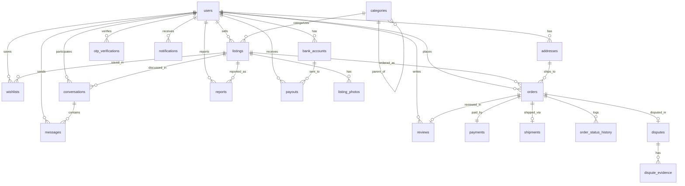

# ERD & Database Structure — Marketplace Sepeda MVP

**Versi:** 1.0
**Tanggal:** 2026-04-24
**Referensi PRD:** [PRD-marketplace-sepeda-MVP.md](PRD-marketplace-sepeda-MVP.md)
**Target DBMS:** PostgreSQL 15+ (rekomendasi)

---

## 1. Prinsip Desain

- **Primary key:** UUID v4 (`id UUID PRIMARY KEY DEFAULT gen_random_uuid()`) — aman untuk distributed, tidak bocor jumlah data.
- **Timestamp standar:** semua tabel punya `created_at`, `updated_at` (TIMESTAMPTZ, default NOW()).
- **Soft delete:** hanya untuk entitas penting (`users`, `listings`, `orders`) via kolom `deleted_at`. Tabel lain boleh hard delete.
- **Uang (money):** gunakan `BIGINT` menyimpan satuan **Rupiah sen / lowest unit** (atau langsung IDR utuh karena tidak ada pecahan). MVP pakai `BIGINT` IDR (tidak ada desimal di IDR). Jangan pakai FLOAT.
- **Enum:** PostgreSQL native `CREATE TYPE ... AS ENUM`. Alternatif: VARCHAR + CHECK constraint.
- **JSONB** untuk data semi-struktur (spesifikasi listing, metadata payment).
- **Audit trail** untuk state kritikal (order status history).

---

## 2. Diagram ERD



---

## 3. Skema Tabel Detail

### 3.1 `users`
Pengguna (pembeli & penjual — satu tabel, peran kontekstual).

| Kolom | Tipe | Constraint | Catatan |
|---|---|---|---|
| id | UUID | PK | |
| email | VARCHAR(255) | UNIQUE, NOT NULL | lowercased |
| phone | VARCHAR(20) | UNIQUE | format E.164 (`+62...`) |
| password_hash | VARCHAR(255) | | nullable untuk user OAuth-only |
| full_name | VARCHAR(100) | NOT NULL | |
| avatar_url | TEXT | | |
| bio | VARCHAR(500) | | |
| city | VARCHAR(100) | | kota default (bukan alamat lengkap) |
| phone_verified_at | TIMESTAMPTZ | | null = belum verifikasi |
| email_verified_at | TIMESTAMPTZ | | |
| kyc_status | ENUM | DEFAULT 'none' | `none`, `pending`, `verified`, `rejected` |
| google_oauth_id | VARCHAR(255) | UNIQUE | |
| rating_avg | DECIMAL(3,2) | DEFAULT 0 | agregat dari reviews |
| rating_count | INT | DEFAULT 0 | |
| last_active_at | TIMESTAMPTZ | | |
| balance | BIGINT | DEFAULT 0 | saldo penjual (IDR) |
| created_at | TIMESTAMPTZ | | |
| updated_at | TIMESTAMPTZ | | |
| deleted_at | TIMESTAMPTZ | | soft delete |

**Index:** `email`, `phone`, `google_oauth_id`, `(deleted_at)`

---

### 3.2 `otp_verifications`
Untuk verifikasi HP atau reset password.

| Kolom | Tipe | Constraint | Catatan |
|---|---|---|---|
| id | UUID | PK | |
| user_id | UUID | FK → users.id, NULLABLE | null kalau belum ada akun |
| channel | ENUM | | `sms`, `whatsapp`, `email` |
| purpose | ENUM | | `phone_verify`, `password_reset`, `login_2fa` |
| target | VARCHAR(255) | NOT NULL | nomor HP / email |
| code_hash | VARCHAR(255) | NOT NULL | jangan simpan plain code |
| expires_at | TIMESTAMPTZ | NOT NULL | |
| used_at | TIMESTAMPTZ | | null = belum dipakai |
| attempts | SMALLINT | DEFAULT 0 | rate limiting |
| created_at | TIMESTAMPTZ | | |

**Index:** `(target, purpose, expires_at)`

---

### 3.3 `addresses`
Alamat pengiriman pembeli.

| Kolom | Tipe | Constraint | Catatan |
|---|---|---|---|
| id | UUID | PK | |
| user_id | UUID | FK → users.id ON DELETE CASCADE | |
| label | VARCHAR(50) | | "Rumah", "Kantor" |
| recipient_name | VARCHAR(100) | NOT NULL | |
| recipient_phone | VARCHAR(20) | NOT NULL | |
| province | VARCHAR(100) | NOT NULL | |
| city | VARCHAR(100) | NOT NULL | |
| district | VARCHAR(100) | | kecamatan |
| postal_code | VARCHAR(10) | | |
| full_address | TEXT | NOT NULL | jalan, RT/RW, detail |
| is_primary | BOOLEAN | DEFAULT false | |
| created_at, updated_at | TIMESTAMPTZ | | |

**Index:** `user_id`

**Business rule:** hanya 1 address boleh `is_primary=true` per user (partial unique index).

---

### 3.4 `bank_accounts`
Rekening bank untuk pencairan dana penjual.

| Kolom | Tipe | Constraint | Catatan |
|---|---|---|---|
| id | UUID | PK | |
| user_id | UUID | FK → users.id ON DELETE CASCADE | |
| bank_code | VARCHAR(10) | NOT NULL | `bca`, `mandiri`, `bni`, `bri`, dst |
| bank_name | VARCHAR(50) | NOT NULL | |
| account_number | VARCHAR(30) | NOT NULL | |
| account_holder_name | VARCHAR(100) | NOT NULL | |
| verified_at | TIMESTAMPTZ | | verifikasi via name validation API |
| is_primary | BOOLEAN | DEFAULT false | |
| created_at, updated_at | TIMESTAMPTZ | | |

**Index:** `user_id`

---

### 3.5 `categories`
Kategori & sub-kategori (self-referencing).

| Kolom | Tipe | Constraint | Catatan |
|---|---|---|---|
| id | UUID | PK | |
| parent_id | UUID | FK → categories.id, NULLABLE | null = root category |
| name | VARCHAR(100) | NOT NULL | "Sepeda Utuh", "Roadbike" |
| slug | VARCHAR(100) | UNIQUE, NOT NULL | "sepeda-utuh", "roadbike" |
| icon_url | TEXT | | |
| spec_schema | JSONB | | definisi field spesifik (lihat §4.1) |
| sort_order | INT | DEFAULT 0 | |
| is_active | BOOLEAN | DEFAULT true | |
| created_at, updated_at | TIMESTAMPTZ | | |

**Index:** `parent_id`, `slug`

---

### 3.6 `listings`
Barang yang didaftarkan untuk dijual.

| Kolom | Tipe | Constraint | Catatan |
|---|---|---|---|
| id | UUID | PK | |
| seller_id | UUID | FK → users.id, NOT NULL | |
| category_id | UUID | FK → categories.id, NOT NULL | sub-category terdalam |
| title | VARCHAR(120) | NOT NULL | |
| slug | VARCHAR(150) | UNIQUE | URL-friendly, dibuat saat publish |
| description | TEXT | | markdown-lite |
| brand | VARCHAR(100) | | |
| model | VARCHAR(100) | | |
| year | SMALLINT | | |
| frame_size | VARCHAR(20) | | "M", "52", "54cm" |
| groupset | VARCHAR(100) | | |
| frame_material | ENUM | | `aluminum`, `carbon`, `steel`, `titanium`, `other` |
| condition | ENUM | NOT NULL | `new`, `like_new`, `used_mint`, `used_normal`, `used_repair_needed` |
| price | BIGINT | NOT NULL | IDR |
| is_negotiable | BOOLEAN | DEFAULT false | |
| allow_cod | BOOLEAN | DEFAULT false | |
| city | VARCHAR(100) | NOT NULL | lokasi barang |
| province | VARCHAR(100) | NOT NULL | |
| extra_specs | JSONB | | field custom per kategori |
| status | ENUM | DEFAULT 'draft' | `draft`, `active`, `paused`, `sold`, `removed`, `rejected` |
| view_count | INT | DEFAULT 0 | |
| wishlist_count | INT | DEFAULT 0 | denormalized |
| published_at | TIMESTAMPTZ | | |
| sold_at | TIMESTAMPTZ | | |
| created_at, updated_at | TIMESTAMPTZ | | |
| deleted_at | TIMESTAMPTZ | | |

**Index:**
- `seller_id`
- `category_id`
- `status` (partial: `WHERE status = 'active'`)
- `(city, status)` — pencarian by kota
- `price` untuk filter range
- Full-text search index pada `(title, description, brand, model)` — `tsvector`

---

### 3.7 `listing_photos`
Foto listing (1 listing bisa punya banyak foto).

| Kolom | Tipe | Constraint | Catatan |
|---|---|---|---|
| id | UUID | PK | |
| listing_id | UUID | FK → listings.id ON DELETE CASCADE | |
| url | TEXT | NOT NULL | |
| thumbnail_url | TEXT | | |
| sort_order | SMALLINT | DEFAULT 0 | 0 = foto utama |
| created_at | TIMESTAMPTZ | | |

**Index:** `(listing_id, sort_order)`

---

### 3.8 `wishlists`
Simpan listing (favorit).

| Kolom | Tipe | Constraint | Catatan |
|---|---|---|---|
| id | UUID | PK | |
| user_id | UUID | FK → users.id ON DELETE CASCADE | |
| listing_id | UUID | FK → listings.id ON DELETE CASCADE | |
| created_at | TIMESTAMPTZ | | |

**Unique:** `(user_id, listing_id)` — tidak bisa save duplikat.

---

### 3.9 `conversations`
Thread chat antara 2 user terkait 1 listing.

| Kolom | Tipe | Constraint | Catatan |
|---|---|---|---|
| id | UUID | PK | |
| listing_id | UUID | FK → listings.id, NOT NULL | |
| buyer_id | UUID | FK → users.id, NOT NULL | |
| seller_id | UUID | FK → users.id, NOT NULL | |
| last_message_at | TIMESTAMPTZ | | untuk sorting inbox |
| buyer_unread_count | INT | DEFAULT 0 | |
| seller_unread_count | INT | DEFAULT 0 | |
| created_at, updated_at | TIMESTAMPTZ | | |

**Unique:** `(listing_id, buyer_id, seller_id)` — hanya 1 thread per listing per pair.

**Index:** `buyer_id`, `seller_id`, `last_message_at`

---

### 3.10 `messages`
Pesan dalam conversation.

| Kolom | Tipe | Constraint | Catatan |
|---|---|---|---|
| id | UUID | PK | |
| conversation_id | UUID | FK → conversations.id ON DELETE CASCADE | |
| sender_id | UUID | FK → users.id | |
| body | TEXT | | bisa null kalau attachment-only |
| attachment_url | TEXT | | gambar |
| flagged_reason | VARCHAR(100) | | auto-detect nomor rekening, dll |
| read_at | TIMESTAMPTZ | | |
| created_at | TIMESTAMPTZ | | |

**Index:** `(conversation_id, created_at)`

---

### 3.11 `orders`
Pemesanan (1 order = 1 listing di MVP, tidak ada cart multi-item).

| Kolom | Tipe | Constraint | Catatan |
|---|---|---|---|
| id | UUID | PK | |
| order_number | VARCHAR(20) | UNIQUE, NOT NULL | human-readable, e.g. `ORD-20260424-0001` |
| listing_id | UUID | FK → listings.id, NOT NULL | |
| buyer_id | UUID | FK → users.id, NOT NULL | |
| seller_id | UUID | FK → users.id, NOT NULL | denormalized dari listing saat order |
| address_id | UUID | FK → addresses.id, NOT NULL | |
| shipping_address_snapshot | JSONB | NOT NULL | snapshot — alamat bisa berubah tapi order tidak |
| item_price | BIGINT | NOT NULL | harga barang saat order |
| shipping_cost | BIGINT | DEFAULT 0 | |
| shipping_courier | VARCHAR(50) | | `jne`, `jnt`, `sicepat`, dll |
| shipping_service | VARCHAR(50) | | `REG`, `YES`, `EZ` |
| admin_fee | BIGINT | DEFAULT 0 | fee rekber (1% dari item_price) |
| insurance_fee | BIGINT | DEFAULT 0 | |
| total_amount | BIGINT | NOT NULL | = item_price + shipping_cost + admin_fee + insurance_fee |
| status | ENUM | DEFAULT 'pending_payment' | lihat §4.2 |
| payment_due_at | TIMESTAMPTZ | | 1x24 jam dari create |
| paid_at | TIMESTAMPTZ | | |
| shipped_at | TIMESTAMPTZ | | |
| delivered_at | TIMESTAMPTZ | | auto-confirm cutoff = +3 hari |
| completed_at | TIMESTAMPTZ | | dana cair ke penjual |
| cancelled_at | TIMESTAMPTZ | | |
| cancellation_reason | VARCHAR(255) | | |
| notes_to_seller | TEXT | | |
| created_at, updated_at | TIMESTAMPTZ | | |
| deleted_at | TIMESTAMPTZ | | |

**Index:** `buyer_id`, `seller_id`, `listing_id`, `status`, `order_number`

---

### 3.12 `order_status_history`
Audit trail perubahan status order.

| Kolom | Tipe | Constraint | Catatan |
|---|---|---|---|
| id | UUID | PK | |
| order_id | UUID | FK → orders.id ON DELETE CASCADE | |
| from_status | VARCHAR(30) | | null jika initial |
| to_status | VARCHAR(30) | NOT NULL | |
| actor_id | UUID | FK → users.id, NULLABLE | null kalau system/auto |
| actor_type | ENUM | | `buyer`, `seller`, `system`, `admin` |
| notes | TEXT | | |
| created_at | TIMESTAMPTZ | | |

**Index:** `(order_id, created_at)`

---

### 3.13 `payments`
Satu order = satu payment record (1:1).

| Kolom | Tipe | Constraint | Catatan |
|---|---|---|---|
| id | UUID | PK | |
| order_id | UUID | FK → orders.id, UNIQUE, NOT NULL | |
| provider | ENUM | NOT NULL | `midtrans`, `xendit` |
| provider_payment_id | VARCHAR(100) | | ID dari gateway |
| payment_method | VARCHAR(50) | | `bca_va`, `gopay`, `qris`, `credit_card` |
| amount | BIGINT | NOT NULL | |
| status | ENUM | DEFAULT 'pending' | `pending`, `paid`, `failed`, `expired`, `refunded` |
| va_number | VARCHAR(50) | | kalau VA |
| qr_string | TEXT | | kalau QRIS |
| expired_at | TIMESTAMPTZ | | |
| paid_at | TIMESTAMPTZ | | |
| raw_response | JSONB | | full response dari gateway |
| created_at, updated_at | TIMESTAMPTZ | | |

**Index:** `order_id`, `provider_payment_id`, `status`

---

### 3.14 `shipments`
Informasi pengiriman (diisi penjual setelah kirim).

| Kolom | Tipe | Constraint | Catatan |
|---|---|---|---|
| id | UUID | PK | |
| order_id | UUID | FK → orders.id, UNIQUE, NOT NULL | |
| courier | VARCHAR(50) | NOT NULL | |
| service | VARCHAR(50) | | |
| tracking_number | VARCHAR(100) | NOT NULL | nomor resi |
| receipt_photo_url | TEXT | | foto bukti kirim |
| shipped_at | TIMESTAMPTZ | NOT NULL | |
| delivered_at | TIMESTAMPTZ | | dari webhook ekspedisi (post-MVP) / manual |
| status | ENUM | DEFAULT 'in_transit' | `in_transit`, `delivered`, `lost`, `returned` |
| tracking_history | JSONB | | raw tracking events |
| created_at, updated_at | TIMESTAMPTZ | | |

**Index:** `order_id`, `tracking_number`

---

### 3.15 `payouts`
Pencairan dana dari saldo penjual ke rekening bank.

| Kolom | Tipe | Constraint | Catatan |
|---|---|---|---|
| id | UUID | PK | |
| user_id | UUID | FK → users.id, NOT NULL | penjual |
| bank_account_id | UUID | FK → bank_accounts.id, NOT NULL | |
| amount | BIGINT | NOT NULL | |
| fee | BIGINT | DEFAULT 0 | biaya admin disbursement |
| net_amount | BIGINT | NOT NULL | amount - fee |
| provider | ENUM | | `midtrans_iris`, `xendit_disbursement` |
| provider_payout_id | VARCHAR(100) | | |
| status | ENUM | DEFAULT 'pending' | `pending`, `processing`, `completed`, `failed` |
| failure_reason | TEXT | | |
| processed_at | TIMESTAMPTZ | | |
| raw_response | JSONB | | |
| created_at, updated_at | TIMESTAMPTZ | | |

**Index:** `user_id`, `status`

---

### 3.16 `reviews`
Rating & review setelah order selesai.

| Kolom | Tipe | Constraint | Catatan |
|---|---|---|---|
| id | UUID | PK | |
| order_id | UUID | FK → orders.id, UNIQUE, NOT NULL | 1 review per order |
| reviewer_id | UUID | FK → users.id, NOT NULL | buyer |
| reviewee_id | UUID | FK → users.id, NOT NULL | seller |
| rating | SMALLINT | CHECK 1..5, NOT NULL | |
| comment | TEXT | | |
| seller_reply | TEXT | | |
| seller_replied_at | TIMESTAMPTZ | | |
| created_at, updated_at | TIMESTAMPTZ | | |

**Index:** `reviewee_id`, `reviewer_id`

---

### 3.17 `disputes`
Sengketa transaksi.

| Kolom | Tipe | Constraint | Catatan |
|---|---|---|---|
| id | UUID | PK | |
| order_id | UUID | FK → orders.id, UNIQUE, NOT NULL | |
| opened_by | UUID | FK → users.id, NOT NULL | biasanya buyer |
| reason | ENUM | NOT NULL | `not_received`, `not_as_described`, `damaged`, `fake`, `other` |
| description | TEXT | NOT NULL | |
| status | ENUM | DEFAULT 'open' | `open`, `investigating`, `resolved_buyer`, `resolved_seller`, `cancelled` |
| resolution_notes | TEXT | | |
| resolved_by | UUID | FK → users.id | admin |
| resolved_at | TIMESTAMPTZ | | |
| refund_amount | BIGINT | | kalau resolved_buyer |
| created_at, updated_at | TIMESTAMPTZ | | |

**Index:** `order_id`, `status`

---

### 3.18 `dispute_evidence`
Bukti yang diupload pihak sengketa.

| Kolom | Tipe | Constraint | Catatan |
|---|---|---|---|
| id | UUID | PK | |
| dispute_id | UUID | FK → disputes.id ON DELETE CASCADE | |
| uploader_id | UUID | FK → users.id | |
| file_url | TEXT | NOT NULL | |
| file_type | VARCHAR(20) | | `image`, `video`, `document` |
| note | TEXT | | |
| created_at | TIMESTAMPTZ | | |

**Index:** `dispute_id`

---

### 3.19 `reports`
Report listing/user (trust & safety).

| Kolom | Tipe | Constraint | Catatan |
|---|---|---|---|
| id | UUID | PK | |
| reporter_id | UUID | FK → users.id, NOT NULL | |
| target_type | ENUM | NOT NULL | `listing`, `user`, `message` |
| target_id | UUID | NOT NULL | polymorphic — tergantung target_type |
| reason | ENUM | NOT NULL | `fake_product`, `scam`, `inappropriate`, `spam`, `other` |
| description | TEXT | | |
| status | ENUM | DEFAULT 'open' | `open`, `reviewed`, `action_taken`, `dismissed` |
| reviewed_by | UUID | FK → users.id | admin |
| reviewed_at | TIMESTAMPTZ | | |
| created_at, updated_at | TIMESTAMPTZ | | |

**Index:** `(target_type, target_id)`, `status`

---

### 3.20 `notifications`
Notifikasi in-app.

| Kolom | Tipe | Constraint | Catatan |
|---|---|---|---|
| id | UUID | PK | |
| user_id | UUID | FK → users.id ON DELETE CASCADE | |
| type | VARCHAR(50) | NOT NULL | `new_message`, `order_paid`, `order_shipped`, dst |
| title | VARCHAR(150) | NOT NULL | |
| body | TEXT | | |
| data | JSONB | | payload (order_id, conversation_id, dll) |
| read_at | TIMESTAMPTZ | | |
| created_at | TIMESTAMPTZ | | |

**Index:** `(user_id, read_at)`, `(user_id, created_at DESC)`

---

## 4. Keputusan Desain Penting

### 4.1 Spesifikasi Fleksibel per Kategori (`extra_specs` JSONB)

Kategori sepeda (roadbike) butuh field berbeda dengan kategori helm. Daripada pakai tabel EAV kompleks, MVP pakai pendekatan hybrid:

- **Field umum yang sering difilter** jadi kolom terdedikasi (`brand`, `frame_size`, `groupset`, `frame_material`, `condition`) — bisa di-index.
- **Field spesifik** yang jarang difilter disimpan di `listings.extra_specs` JSONB.
- **Schema per kategori** di `categories.spec_schema` mendikte field apa yang perlu ditampilkan di form.

Contoh `categories.spec_schema` untuk "Helm":
```json
{
  "fields": [
    {"key": "size", "label": "Ukuran", "type": "enum", "options": ["S","M","L","XL"], "required": true},
    {"key": "certification", "label": "Sertifikasi", "type": "text"},
    {"key": "weight_g", "label": "Berat (gram)", "type": "number"}
  ]
}
```

Contoh `listings.extra_specs`:
```json
{"size": "M", "certification": "CE EN-1078", "weight_g": 250}
```

### 4.2 State Machine Order

```
pending_payment ──(payment received)──> paid
     │                                    │
     │(expired / cancelled by buyer)      │
     ▼                                    ▼
  cancelled                          shipped (seller input resi)
                                          │
                                          ▼
                                      delivered (auto or manual)
                                          │
                                          │ (buyer confirms or +3 days)
                                          ▼
                                      completed ──(payout to seller)
                                          
  [at any paid+ state] ── buyer opens dispute ──> disputed
                                                      │
                                            (admin resolves)
                                                      │
                                      ┌───────────────┼───────────────┐
                                      ▼               ▼               ▼
                                   refunded      seller wins       cancelled
```

Semua transisi wajib dicatat di `order_status_history`.

### 4.3 Snapshot Data

**Masalah:** Kalau buyer edit alamat setelah order dibuat, alamat order tidak boleh ikut berubah. Sama dengan harga listing.

**Solusi:** Simpan snapshot data penting di tabel order saat dibuat:
- `orders.shipping_address_snapshot` (JSONB) — full alamat saat order dibuat.
- `orders.item_price` — harga listing saat order, bukan reference ke `listings.price`.
- `orders.seller_id` — denormalized, tidak bergantung ke `listing.seller_id` yang mungkin berubah (meskipun jarang).

### 4.4 Saldo Penjual — Single Source of Truth

`users.balance` hanya diupdate lewat transaksi database bersama dengan pencatatan di tabel lain (order completion, payout). Pertimbangkan tabel `balance_ledger` terpisah untuk audit (di luar MVP, post-launch):

```
balance_ledger (id, user_id, type, amount, reference_type, reference_id, balance_after, created_at)
```

Di MVP, cukup andalkan `order_status_history` + `payouts` sebagai audit.

### 4.5 Full-Text Search

Untuk MVP pakai PostgreSQL built-in FTS:

```sql
ALTER TABLE listings ADD COLUMN search_vector tsvector
  GENERATED ALWAYS AS (
    setweight(to_tsvector('simple', coalesce(title,'')), 'A') ||
    setweight(to_tsvector('simple', coalesce(brand,'') || ' ' || coalesce(model,'')), 'B') ||
    setweight(to_tsvector('simple', coalesce(description,'')), 'C')
  ) STORED;

CREATE INDEX idx_listings_search ON listings USING GIN(search_vector);
```

Post-MVP bisa upgrade ke Meilisearch/Algolia/Elasticsearch kalau perlu faceted search lebih canggih.

### 4.6 Deteksi Nomor Rekening di Chat

Pakai regex sederhana saat insert message:
- Pola nomor bank Indonesia: `\b\d{10,16}\b` dikombinasi dengan kata kunci `bca|mandiri|bni|bri|rekening|rek|transfer|tf`.

Kalau match → set `messages.flagged_reason = 'suspected_external_payment'` + tampilkan warning banner ke penerima. Tidak block pesan, hanya peringatan.

---

## 5. Ringkasan Index Strategy

| Tabel | Index Kunci | Alasan |
|---|---|---|
| users | email, phone | login & lookup |
| listings | (status) partial WHERE active, (city, status), category_id, price, GIN(search_vector) | homepage & search |
| orders | buyer_id, seller_id, status, order_number | dashboard order |
| messages | (conversation_id, created_at) | load thread |
| conversations | buyer_id, seller_id, last_message_at | inbox sort |
| notifications | (user_id, read_at), (user_id, created_at DESC) | badge count & feed |
| wishlists | UNIQUE(user_id, listing_id) | dedup save |
| reviews | reviewee_id | tampilkan rating profile |

---

## 6. Perkiraan Volume Data (tahun 1)

| Tabel | Estimasi Baris |
|---|---|
| users | 10.000 |
| listings | 5.000 (aktif + historis) |
| listing_photos | 30.000 |
| orders | 1.500 |
| payments | 1.500 |
| messages | 200.000 |
| notifications | 500.000 |

Tidak butuh sharding/partitioning di MVP. `notifications` bisa di-partition by month kalau volume tumbuh cepat (post-MVP).

---

## 7. Migrasi & Seed Data Awal

Data yang harus di-seed sebelum launch:
- `categories` — 7 root + sub-kategori (sesuai PRD §5.2).
- `categories.spec_schema` untuk tiap kategori.
- Admin user (untuk moderasi).
- List bank (bisa di tabel `banks` terpisah kalau mau, atau hard-coded di app).

---

## 8. Yang Dikecualikan dari MVP

Tabel/fitur berikut **tidak** dibuat di MVP, tapi direncanakan post-launch:
- `balance_ledger` (audit saldo detail)
- `promo_codes` / `vouchers`
- `subscriptions` / toko premium
- `auctions` / bidding
- `follows` (follow penjual)
- `shipping_rate_cache` (kalau mau auto-calc ongkir dari API RajaOngkir/Biteship)
- `search_logs` / analytics
- `admin_users` tabel terpisah (di MVP, pakai flag di `users.is_admin`)

---

**Catatan untuk implementasi:**
- Pakai migration tool (Prisma, Knex, TypeORM migrations, atau SQL raw via Flyway).
- Semua foreign key wajib `ON DELETE` strategy eksplisit: `CASCADE` untuk dependent data, `RESTRICT` untuk data kritikal.
- Set `default_transaction_isolation = 'read committed'` di PostgreSQL; gunakan explicit `SERIALIZABLE` untuk operasi multi-update (order + payment + balance).
