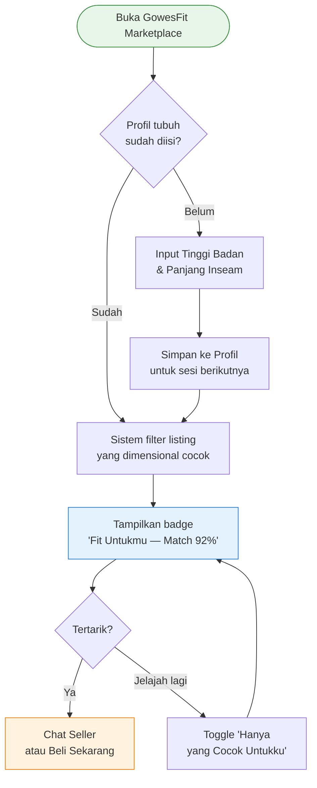
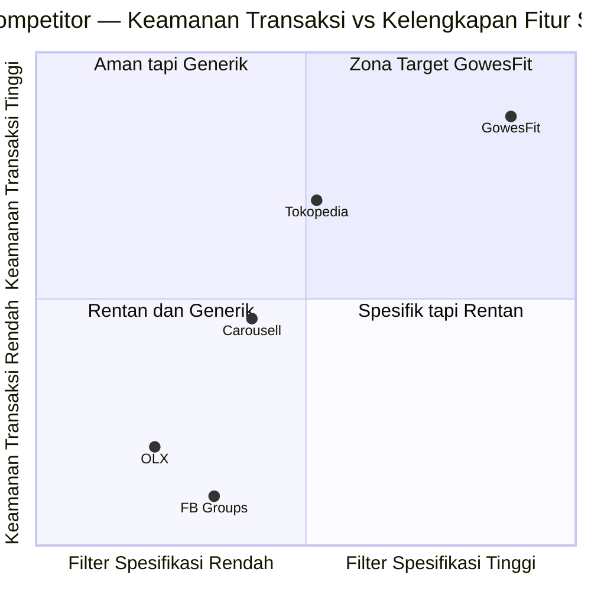
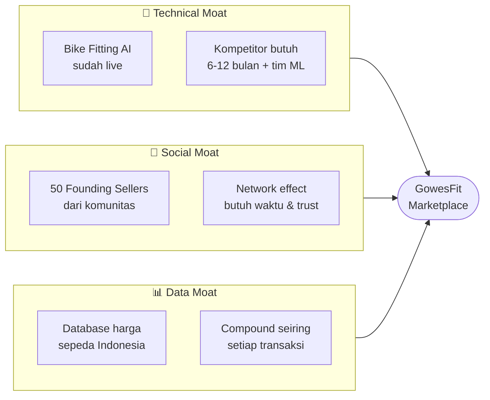
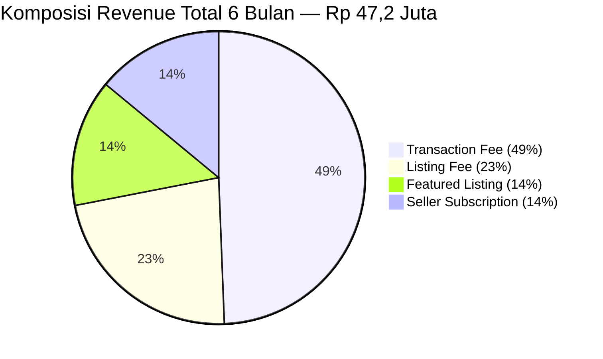
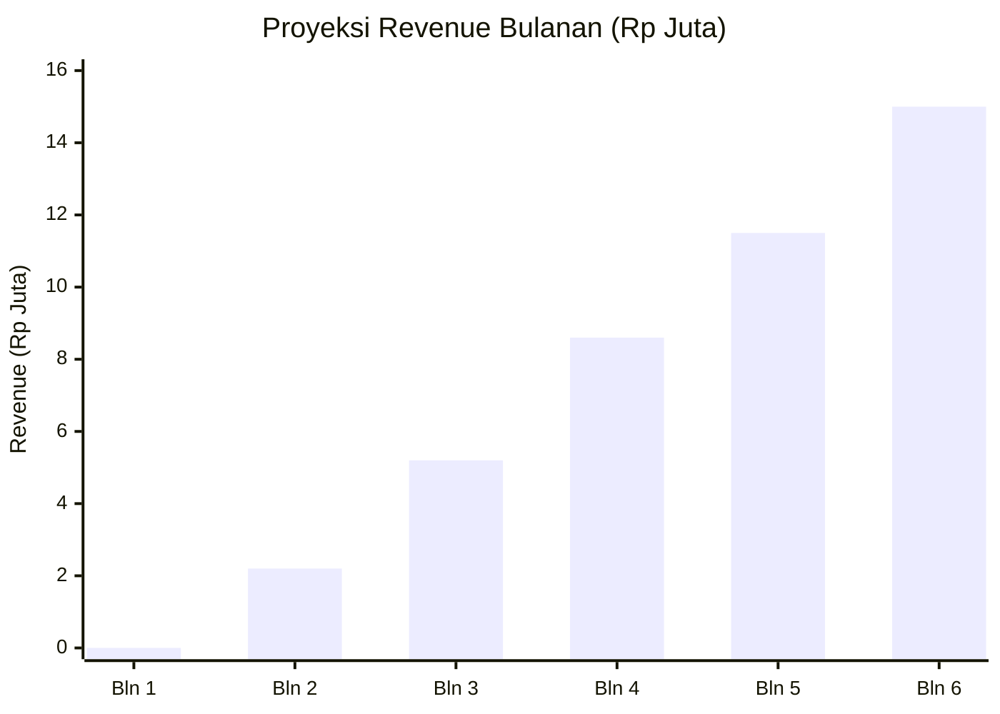
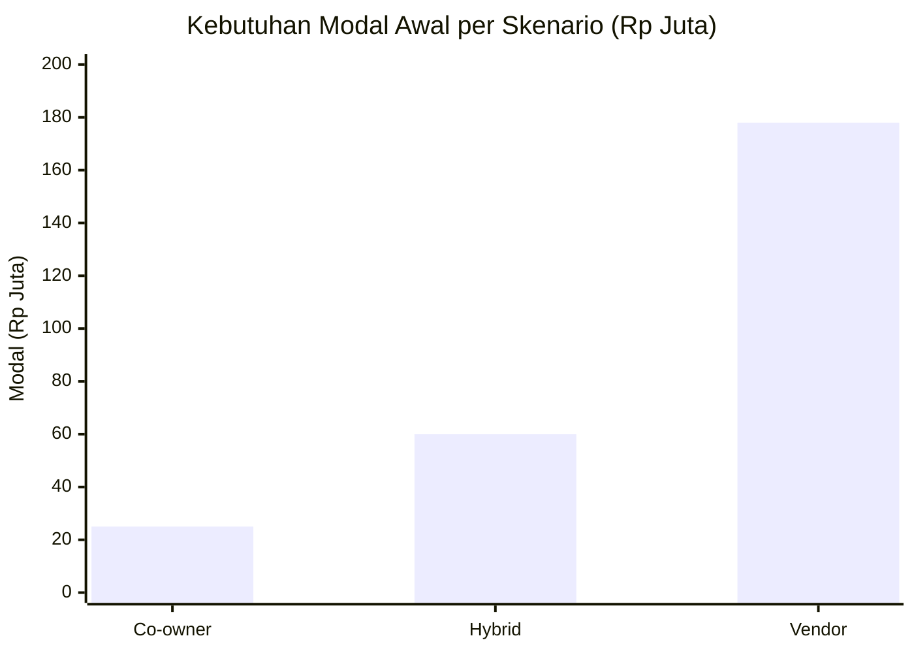
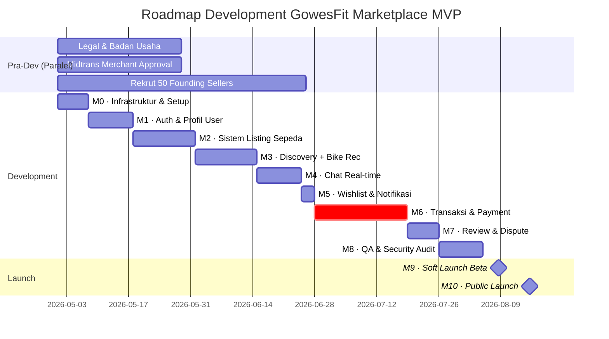
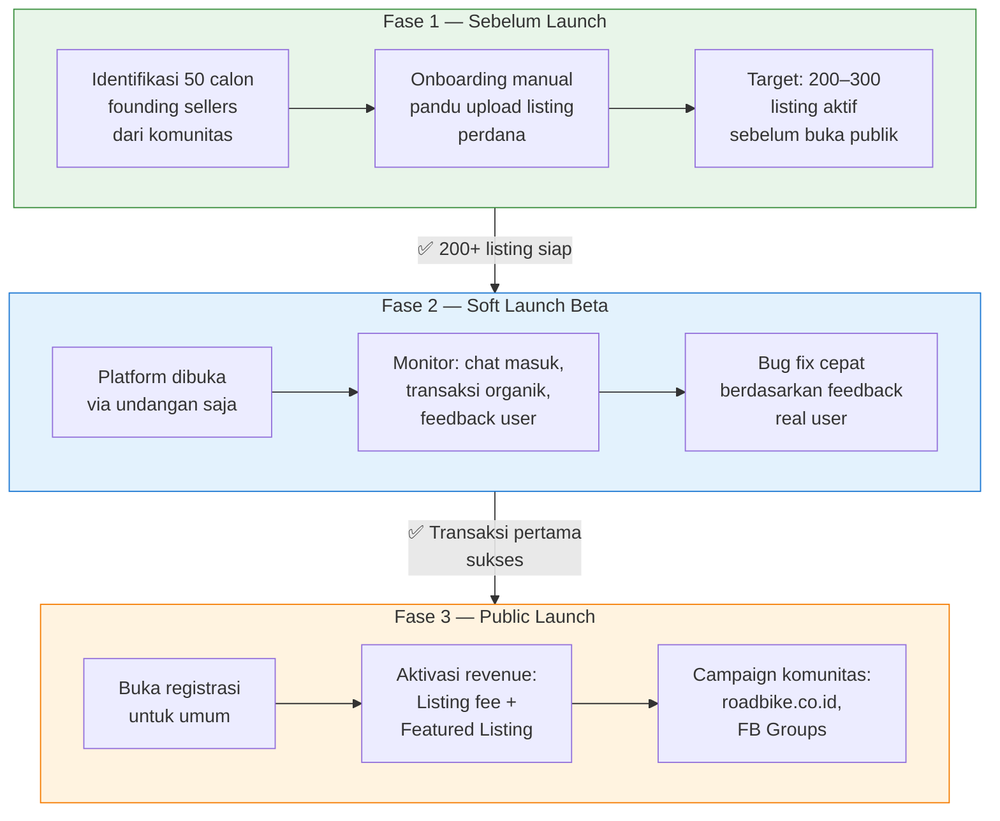
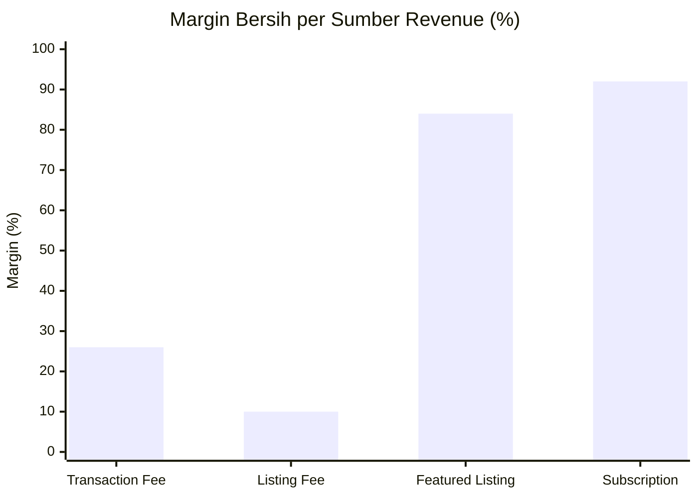

# Proposal Bisnis — GowesFit Marketplace
**Platform Jual Beli Sepeda Khusus Komunitas Indonesia**

**Versi:** 1.0  
**Tanggal:** Mei 2026  
**Status:** Pre-Development — Menuju MVP

---

## Ringkasan Eksekutif

GowesFit adalah platform dua-in-satu: sebuah **alat bike fitting gratis** berbasis kamera (sudah live), dan **marketplace jual beli sepeda** yang sedang dibangun untuk komunitas penggemar sepeda Indonesia.

Proposisi inti GowesFit Marketplace berbeda dari marketplace manapun yang ada saat ini:

> *"Marketplace satu-satunya di Indonesia yang tahu sepeda mana yang FIT untuk tubuhmu — dengan keamanan rekber dan trust dari komunitas goweser."*

Target MVP: **live dalam 4–5 bulan**, dengan modal awal mulai dari **Rp 7–25 juta** (tergantung struktur kerja sama), dan target break-even di bulan ke-9 hingga ke-12.

---

## 1. Masalah yang Ingin Diselesaikan

Pasar sepeda second hand di Indonesia aktif dan besar — komunitas seperti *Roadbike Indonesia* dan berbagai grup Facebook sepeda memiliki puluhan ribu transaksi per bulan. Namun semua platform yang ada saat ini memiliki kekurangan mendasar:

### Dari sisi Pembeli (Buyer)

| Masalah | Dampak |
|---------|--------|
| Tidak ada filter spesifikasi teknis (ukuran frame, groupset, material) | Harus scroll manual ratusan listing |
| Tidak bisa cek apakah ukuran sepeda cocok untuk tubuhnya | Sering salah beli → rugi & kapok |
| Tidak ada proteksi transaksi di Facebook Groups | Rentan penipuan, COD antar kota berisiko |
| Sulit verifikasi keaslian komponen mahal | Beli frame "original" ternyata replika |

### Dari sisi Penjual (Seller)

| Masalah | Dampak |
|---------|--------|
| Listing di Facebook Groups tenggelam cepat | Harus repost berulang, tidak efisien |
| Banyak calon buyer tanya hal sama ("cocok untuk tinggi saya?") | Buang waktu, konversi rendah |
| Tidak ada rekber yang mudah dipakai untuk antar kota | Takut terima pembeli yang tidak dikenal |
| Tidak ada reputasi yang terbawa antar platform | Susah bangun trust ke buyer baru |

### Insight Kunci dari Analisis Kompetitor

Pesaing terbesar GowesFit **bukan** Tokopedia atau OLX — melainkan **Facebook Groups sepeda**, yang saat ini menguasai sekitar 35% transaksi sepeda second hand. Facebook Groups menang karena komunitas dan trust, tapi kalah karena tidak ada proteksi transaksi dan pengalaman yang berantakan.

**GowesFit harus mengalahkan Facebook Groups, bukan Tokopedia.**

---

## 2. Solusi: GowesFit Marketplace

GowesFit Marketplace adalah marketplace sepeda niche yang dibangun di atas tiga fondasi:

### Fondasi 1 — Spec-Rich & Searchable
Filter teknis yang tidak dimiliki platform manapun: ukuran frame, groupset, material, tahun produksi, kisaran harga, kondisi, kota. Pembeli bisa temukan sepeda yang dicari dalam hitungan detik, bukan scroll berjam-jam.

### Fondasi 2 — Bike Recommendation (Killer Feature)
GowesFit sudah memiliki **alat bike fitting berbasis AI** yang bisa mendeteksi posisi berkendara via foto/kamera. Di marketplace, fitur ini diintegrasikan sehingga:

- Pembeli input tinggi badan + panjang kaki → sistem langsung filter sepeda yang ukurannya cocok
- Setiap listing sepeda utuh menampilkan "Cocok untuk pengendara tinggi 168–178 cm"
- Pembeli tidak perlu lagi bertanya "ini muat untuk tinggi saya?"

**Ini differentiator yang tidak bisa ditiru kompetitor dalam waktu singkat.** Membangun teknologi bike fitting dari nol butuh tim ML dan minimum 6+ bulan development.

#### Alur Penggunaan Bike Recommendation

### Fondasi 3 — Trust & Rekber (Escrow)
Semua transaksi dilindungi sistem rekening bersama (rekber/escrow):
- Dana buyer ditahan hingga barang diterima dan dikonfirmasi
- Seller terima dana hanya setelah buyer konfirmasi penerimaan
- Nomor HP seller tidak ditampilkan sebelum ada transaksi aktif
- Rating & badge "X transaksi sukses" hanya diperoleh dari transaksi on-platform

---

## 3. Lanskap Kompetitor

| Platform | Keunggulan | Kelemahan |
|----------|-----------|-----------|
| **Tokopedia / Shopee** | Volume tinggi, payment matang | Tidak ada filter spek sepeda, banyak listing palsu |
| **OLX** | Fokus second hand | UI usang, tidak ada rekber, banyak penipuan |
| **Facebook Groups** | Komunitas aktif, trust tinggi | Tidak ada proteksi transaksi, sulit search |
| **Carousell** | UI bagus, mobile-first | Tidak fokus sepeda, audience dangkal |
| **GowesFit** | Filter spek + rekber + **bike recommendation** | — |

#### Peta Posisi Kompetitor

### Tiga Moat yang Sulit Ditiru

---

## 4. Model Bisnis & Revenue

### Sumber Pendapatan

| Sumber | Mekanisme | Kapan Aktif | Margin |
|--------|-----------|-------------|--------|
| **Transaction Fee** | 1.5–2% dari nilai transaksi, min Rp 5.000 | Bulan 2 | ~26% bersih setelah biaya payment gateway |
| **Featured Listing / Boost** | Rp 25.000 per 7 hari (listing tampil di posisi teratas) | Bulan 2–3 | **84%** |
| **Listing Fee** | Rp 10.000 per listing (opsi fast-track publish) | Bulan 2 | ~10% |
| **Seller Subscription** | Rp 49.000/bulan (fitur premium seller) | Bulan 4+ | **92%** |

> **Catatan penting:** Transaction fee 1% secara matematik rugi karena biaya payment gateway (Midtrans) memakan margin. Fee harus dinaikkan ke **1.5–2%**, atau biaya admin dibebankan secara transparan ke buyer (Rp 10.000–15.000 "biaya proteksi rekber"). Ini akan divalidasi via riset ke calon user sebelum diaktifkan.

#### Komposisi Revenue 6 Bulan (Skenario Realistis)

#### Proyeksi Revenue Bulanan (Skenario Realistis)

### Proyeksi Revenue 6 Bulan (Skenario Realistis)

| Bulan | Listing Aktif | Transaksi | Revenue |
|-------|--------------|-----------|---------|
| 1 | 150 | 0 (gratis, bangun traction) | Rp 0 |
| 2 | 350 | 15 | Rp 2.245.000 |
| 3 | 500 | 50 | Rp 5.150.000 |
| 4 | 700 | 75 | Rp 8.610.000 |
| 5 | 900 | 100 | Rp 11.495.000 |
| 6 | 1.100 | 130 | Rp 14.985.000 |
| **Total** | | **370 transaksi** | **Rp 47.200.000** |

**Gross Merchandise Value (GMV) bulan 6:** ~Rp 819 juta (130 trx × rata-rata Rp 6,3 juta)

### Target MVP (3 Bulan Setelah Launch)
- 500 listing aktif
- 50 transaksi sukses
- 10% conversion rate (listing → terjual)

---

## 5. Kebutuhan Modal

### Struktur Modal Berdasarkan Skenario Kerja Sama

| Skenario | Total Modal Awal | Catatan |
|----------|-----------------|---------|
| **Co-owner (developer sebagai mitra)** | **Rp 7–25 juta** | Developer tidak dibayar cash, kompensasi via equity. Paling efisien. |
| **Hybrid (retainer kecil + equity)** | **Rp 40–60 juta** | Retainer Rp 5–10 juta/bulan selama 4 bulan + equity 10–20% |
| **Vendor / Outsource Development** | **Rp 108–178 juta** | Developer bayar penuh. Break-even mundur ke tahun ke-2 sampai ke-3. |

#### Perbandingan Modal Awal per Skenario

### Breakdown Penggunaan Modal (Skenario Co-owner — Minimum Rp 7,2 juta)

| Komponen | Biaya |
|----------|-------|
| Pendirian CV/PT (notaris, NIB, rekening bisnis) | Rp 3,1–5 juta |
| Privacy Policy & Terms of Service (konsultasi lawyer) | Rp 1,5 juta |
| Domain (.com + .id) | Rp 500.000 |
| Marketing soft launch (outreach komunitas, konten) | Rp 1 juta |
| Buffer operasional 3 bulan | Rp 750.000 |
| **Total Minimum** | **~Rp 7,2 juta** |

### Biaya Operasional Bulanan

| Fase | Biaya/bulan | Keterangan |
|------|------------|-----------|
| Bulan 1–3 (pre-traction) | Rp 162.000–252.000 | Mayoritas pakai free tier layanan cloud |
| Bulan 4–6 (early growth) | Rp 862.000 | Mulai upgrade beberapa layanan |
| Bulan 7–12 (scale) | Rp 2–3 juta | Scale seiring traffic |

> Layanan teknologi (hosting, database, email, analytics) yang digunakan sebagian besar tersedia dalam paket gratis yang cukup untuk 1.000–5.000 user pertama. Ini yang membuat biaya operasional sangat rendah di fase awal.

---

## 6. Rencana Pengembangan — Menuju MVP

Pengembangan dibagi menjadi 10 milestone dengan total estimasi **16–18 minggu (4–4,5 bulan)** dari mulai coding.

### Tahap Pra-Development (2–4 minggu, paralel dengan coding)

Sebelum satu baris kode ditulis, hal-hal berikut wajib diselesaikan:

| Tugas | PIC | Keterangan |
|-------|-----|-----------|
| Sepakati struktur kerja sama (equity vs fee) | Owner + Developer | Kontrak wajib ditandatangani |
| Bentuk badan usaha (CV atau PT) | Owner | Syarat untuk Midtrans production |
| Daftarkan akun Midtrans merchant | Owner | Proses approval 2–4 minggu |
| Siapkan modal awal (minimum Rp 7 juta) | Owner | Untuk biaya legal & operasional |
| Privacy Policy & Terms of Service | Owner + Lawyer | Wajib ada sebelum user nyata |
| Beli domain | Owner | gowesfit.com + gowesfit.id |

### Roadmap Development

### Milestone Terpenting: M6 — Transaksi & Payment
Ini fase paling kritikal dan dialokasikan waktu terpanjang (3 minggu). Kesalahan di sini berarti uang hilang. Semua alur pembayaran harus diuji tuntas di environment sandbox sebelum live ke production.

---

## 7. Apa yang TIDAK Dibangun di MVP

Untuk menjaga fokus dan jadwal, fitur-fitur berikut sengaja ditunda ke fase berikutnya:

```mermaid
flowchart LR
    subgraph MVP["✅ MVP — Bulan 1–4"]
        direction TB
        A1[Listing & Search]
        A2[Bike Recommendation\nLevel 1 — Rule-based]
        A3[Chat Real-time]
        A4[Rekber & Payment]
        A5[Review & Dispute]
    end
    subgraph P2["🔵 Phase 2 — Bulan 5–8"]
        direction TB
        B1[Bike Fitting Integration\nLevel 2 — Pose-based]
        B2[Verified Bike Listing\nbadge serial number]
        B3[Seller Subscription\nPremium]
    end
    subgraph P3["🟣 Phase 3 — Bulan 9–12"]
        direction TB
        C1[Bike Passport\nRiwayat pemilik & servis]
        C2[Bike Inspector Network\nPartner bengkel]
        C3[Price Valuation Tool\nData-driven]
    end
    MVP --> P2 --> P3
```

---

## 8. Strategi Go-to-Market

### Tiga Fase Peluncuran

### Tagline & Positioning

> *"Marketplace Goweser, oleh Goweser"*
> *"Beli Sepeda Bukan Cuma Soal Harga — Tapi Soal Ukuran yang Pas"*

---

## 9. Risiko & Mitigasi

| Risiko | Probabilitas | Mitigasi |
|--------|-------------|---------|
| **Chicken-and-egg problem** (tidak ada seller → tidak ada buyer, atau sebaliknya) | Tinggi | Rekrut 50 seller awal manual sebelum launch. Jangan launch tanpa listing nyata. |
| **Seller bypass platform** (transaksi offline, tidak bayar fee) | Menengah | Sembunyikan nomor HP seller, push nilai rekber, bangun rating hanya dari transaksi on-platform |
| **Fee structure tidak kompetitif** | Menengah | Validasi via customer research sebelum aktivasi. Struktur fee fleksibel: seller atau buyer yang menanggung |
| **Gagal dapat approval Midtrans production** | Rendah | Daftar segera (proses 2–4 minggu). Siapkan badan usaha yang sah. |
| **Rugi di fase awal** | Pasti | Ini normal untuk marketplace baru. Target profitabilitas di bulan 9–12, bukan bulan pertama. |
| **Kompetitor besar masuk ke niche sepeda** | Rendah-Menengah | Moat ada di komunitas dan bike fitting tech. Tokopedia tidak bisa build ini dalam 6 bulan. |

---

## 10. Proyeksi Break-Even & Return

### Dengan Skenario Co-owner

| | Angka |
|-|-------|
| Total investasi awal (legal + operasional + marketing) | Rp 28–30 juta |
| Net loss akumulasi 6 bulan (skenario realistis, fee 1%) | ~Rp 8,5 juta |
| **Break-even** | **Bulan 9–12** (jika fee dinaikkan ke 2% atau push featured listing) |
| Revenue yang dibutuhkan untuk net positif/bulan | ~Rp 25–30 juta/bulan |
| Volume transaksi yang dibutuhkan | 200+ transaksi/bulan |
| GMV pada titik break-even | ~Rp 1,2 miliar/bulan |

### Dengan Skenario Vendor Development

| | Angka |
|-|-------|
| Total investasi | Rp 108–178 juta |
| Break-even | Bulan 24–36 (2–3 tahun) |

> Skenario co-owner jauh lebih efisien dari sisi ROI. Vendor development hanya masuk akal jika ada funding eksternal.

#### Margin per Sumber Revenue — Mengapa Featured Listing & Subscription Adalah Prioritas

> Transaction fee memiliki margin terendah karena biaya payment gateway Midtrans (~1,5% + flat fee) memakan hampir seluruh fee yang ditagihkan. **Featured Listing dan Subscription adalah driver profit sesungguhnya** dengan margin 84–92%.

### Revenue Jangka Panjang (Jika Eksekusi Disiplin)

- **Bulan 12:** Target GMV Rp 1,2 miliar/bulan → net revenue ~Rp 30 juta/bulan
- **Bulan 18–24:** Featured Listing + Subscription jadi revenue backbone (margin 84–92%)
- **Fase 3:** Data transaksi sepeda Indonesia jadi aset unik yang membuka peluang monetisasi baru (Price Valuation Tool, Bike Passport)

---

## 11. Metric Keberhasilan MVP

Berikut ukuran yang akan digunakan untuk menilai apakah MVP berhasil:

| Metric | Target 3 Bulan Setelah Launch |
|--------|-------------------------------|
| Listing aktif | 500+ |
| Registered user | 1.000+ |
| Transaksi sukses | 50+ |
| Conversion rate listing → sold | ≥ 10% |
| Penggunaan fitur Bike Recommendation | ≥ 30% dari buyer yang login |
| Rating kepuasan seller (skala 1–5) | ≥ 4,0 |
| Dispute rate | < 5% dari total transaksi |

---

## 12. Langkah Selanjutnya

Untuk memulai, berikut hal-hal yang perlu disepakati dan dikerjakan **sebelum development dimulai:**

### Keputusan Bisnis (Owner)
- [ ] Tentukan struktur kerja sama: co-owner (equity) vs hybrid vs vendor
- [ ] Tandatangani kontrak / perjanjian kerja sama
- [ ] Bentuk badan usaha (CV atau PT) — konsultasikan dengan notaris
- [ ] Daftar akun Midtrans merchant (mulai proses sekarang, 2–4 minggu approval)
- [ ] Siapkan modal awal sesuai skenario yang dipilih
- [ ] Beli domain gowesfit.com + gowesfit.id

### Validasi Pasar (Sebelum/Paralel Development)
- [ ] Lakukan 15 customer interview (5 seller, 5 buyer, 5 keduanya) dari komunitas
- [ ] Validasi: apakah seller mau bayar fee 2%? Atau lebih nyaman biaya admin ke buyer?
- [ ] Validasi: seberapa menarik fitur Bike Recommendation untuk pemula?
- [ ] Mulai outreach 50 calon founding seller dari komunitas

### Platform Kerja
- [ ] Sepakati tools komunikasi tim (WhatsApp / Notion / Slack)
- [ ] Setup repository kode (GitHub)
- [ ] Tentukan frekuensi sync mingguan

---

## Penutup

GowesFit Marketplace bukan sekadar "OLX versi sepeda." Dengan tiga moat yang tidak bisa ditiru dalam waktu singkat — teknologi bike fitting, komunitas founding sellers, dan data transaksi — GowesFit punya potensi menjadi platform referensi jual beli sepeda di Indonesia.

Modal awal yang dibutuhkan relatif kecil dibandingkan potensi pasarnya. Kunci keberhasilan ada pada eksekusi di tiga bulan pertama: **rekrut seller awal yang tepat, pastikan transaksi pertama berjalan mulus, dan bangun trust komunitas sebelum marketing besar-besaran.**

---

*Dokumen ini disusun berdasarkan PRD v1.0, ERD v1.0, analisis value proposition, simulasi ROI, dan breakdown modal minimum GowesFit Marketplace.*

---

> **Catatan rendering:** Diagram dalam dokumen ini menggunakan format Mermaid dan dapat dirender di GitHub, Notion, GitLab, VS Code (dengan ekstensi Markdown Preview Mermaid Support), dan berbagai tool lainnya. Untuk presentasi, dokumen ini bisa dikonversi ke PDF menggunakan tool seperti Typora atau Pandoc.
