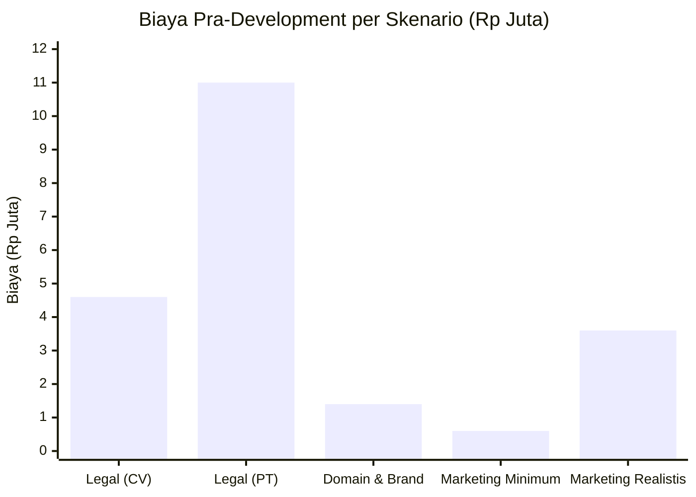
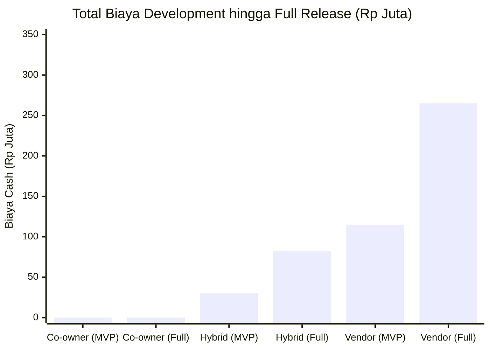
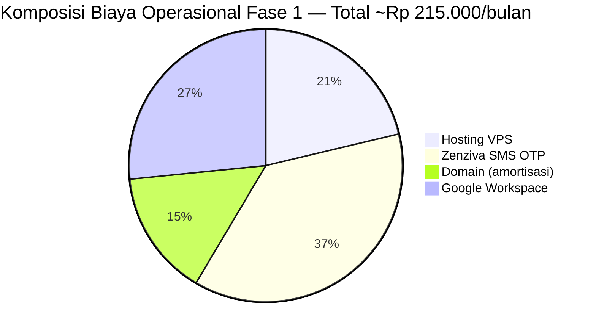
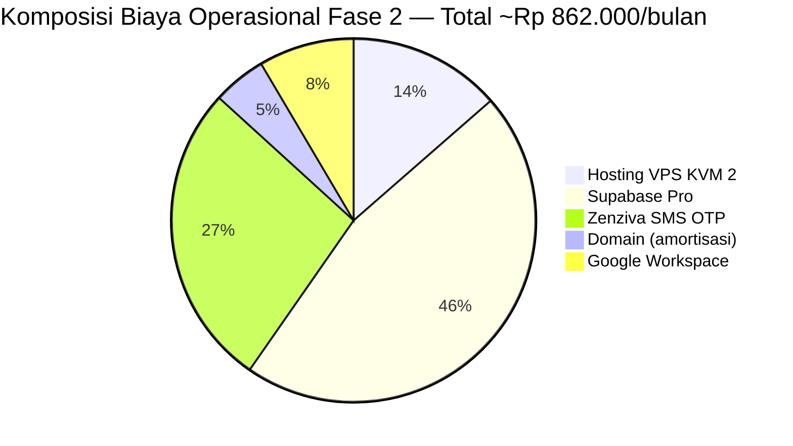
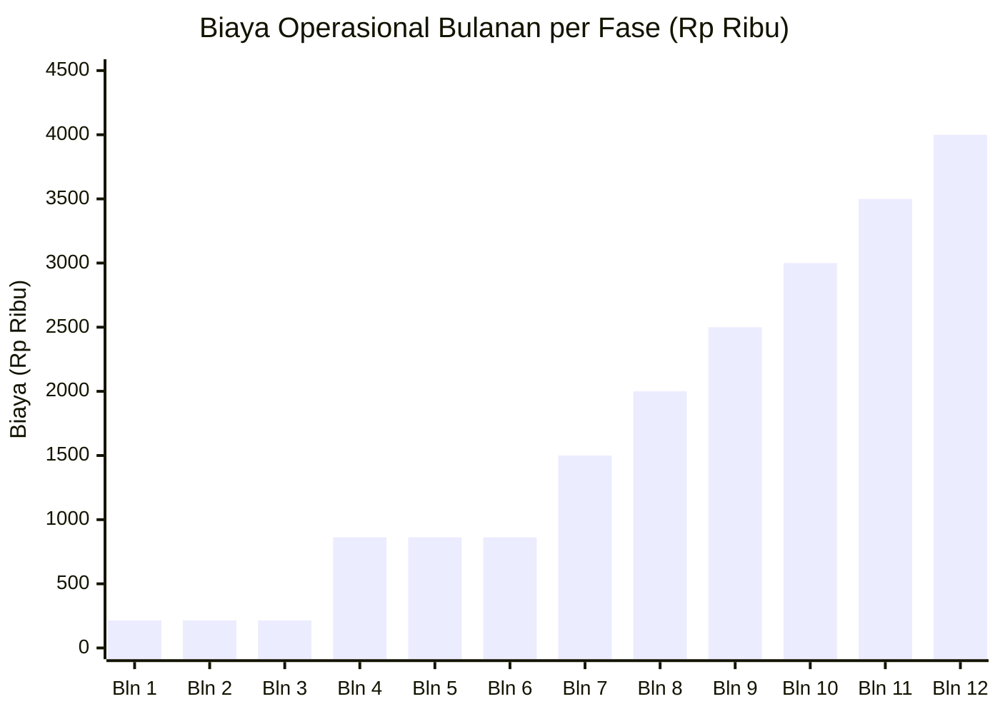
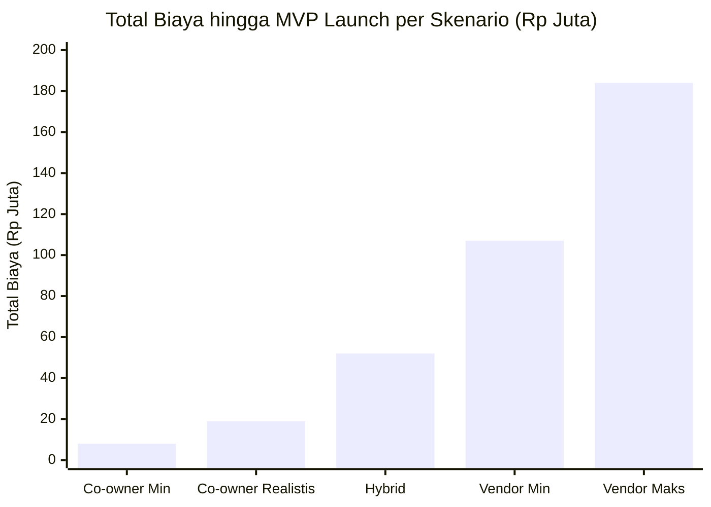
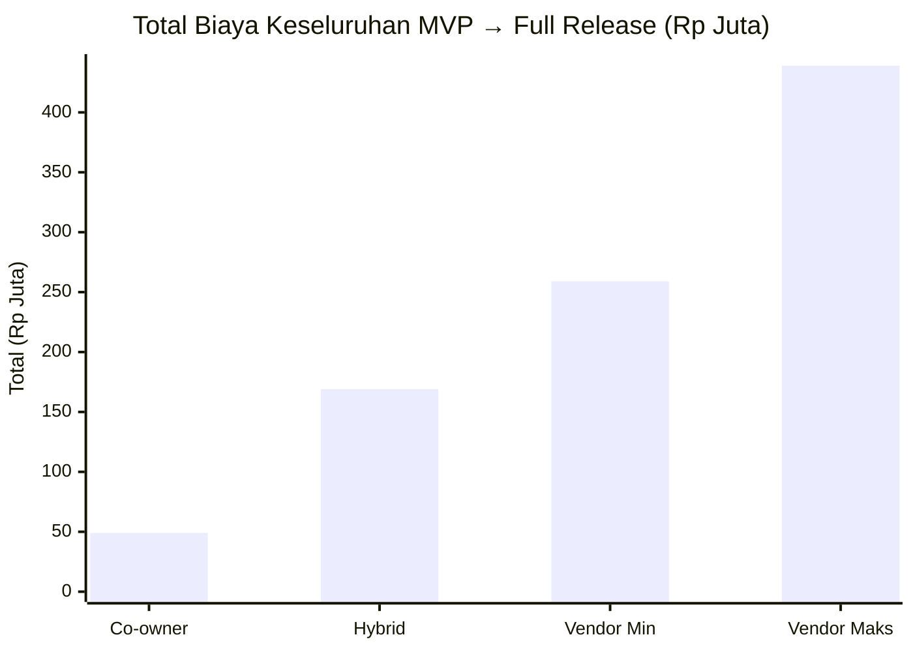
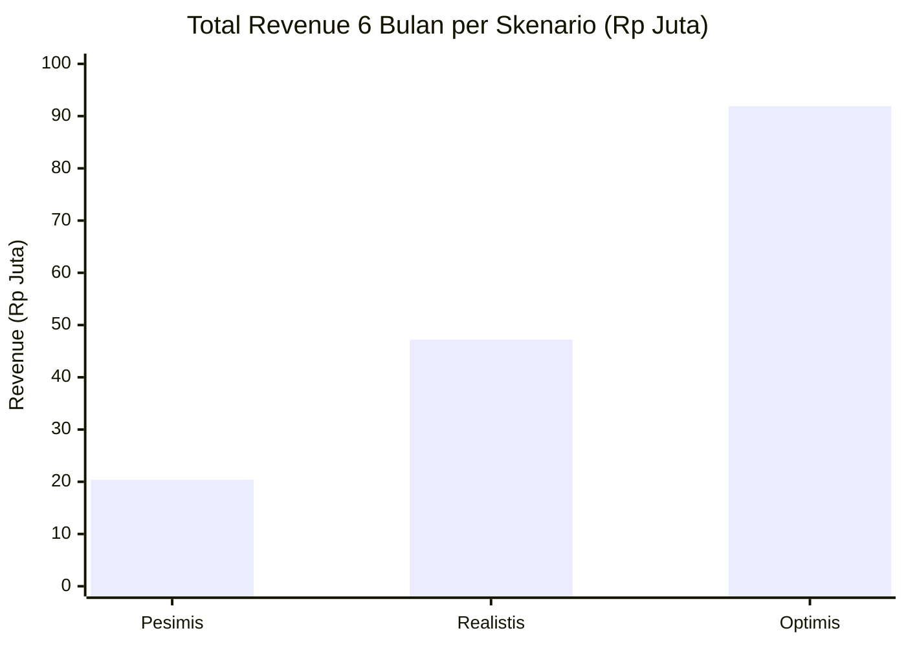
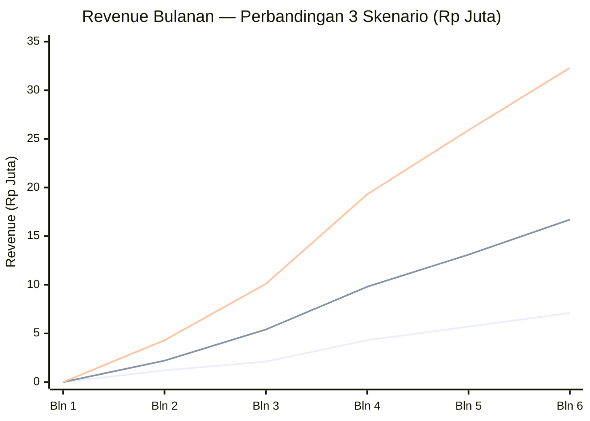

# RAB — Rencana Anggaran Biaya
## GowesFit Marketplace · MVP hingga Full Release

**Versi:** 1.0  
**Tanggal:** Mei 2026  
**Mata uang:** IDR  
**Disclaimer:** Semua angka estimasi berdasarkan riset harga layanan per Mei 2026. Validasi ulang sebelum kontrak ditandatangani.

---

## Daftar Isi

1. [Biaya Pra-Development (One-Time)](#1-biaya-pra-development-one-time)
2. [Biaya Development per Skenario Kerja Sama](#2-biaya-development-per-skenario-kerja-sama)
3. [Rincian Biaya Operasional 3 Fase](#3-rincian-biaya-operasional-3-fase)
4. [Total Biaya Sampai MVP Launch](#4-total-biaya-sampai-mvp-launch)
5. [Biaya Menuju Full Release (Phase 2 & 3)](#5-biaya-menuju-full-release-phase-2--3)
6. [Proyeksi Revenue 6 Bulan — 3 Skenario](#6-proyeksi-revenue-6-bulan--3-skenario)
7. [P&L Summary & Path to Break-Even](#7-pl-summary--path-to-break-even)

---

## 1. Biaya Pra-Development (One-Time)

Biaya ini dikeluarkan **sebelum satu baris kode ditulis** dan wajib ada untuk bisa beroperasi secara legal serta mengaktifkan payment gateway.

### 1.1 Legal & Badan Usaha

| Item | Skenario Hemat (CV) | Skenario Standar (PT) | Keterangan |
|------|--------------------|-----------------------|------------|
| Pendirian badan usaha (notaris + NIB) | Rp 3.000.000 | Rp 7.000.000 | Jasa online: Hukumonline, Easybiz |
| NPWP Perusahaan | Rp 0 | Rp 0 | Gratis di kantor pajak |
| Rekening bank perusahaan (setoran awal) | Rp 100.000 | Rp 1.000.000 | Tergantung bank |
| Konsultasi Privacy Policy + ToS | Rp 1.500.000 | Rp 3.000.000 | Min. 1–2 jam konsultasi lawyer |
| **Subtotal Legal** | **Rp 4.600.000** | **Rp 11.000.000** | |

> **Rekomendasi MVP:** Mulai dengan CV (lebih cepat, lebih murah). Upgrade ke PT saat revenue > Rp 50 juta/bulan atau ada investor masuk.

### 1.2 Domain & Brand

| Item | Biaya | Keterangan |
|------|-------|------------|
| Domain `gowesfit.com` | Rp 200.000/tahun | Via Niagahoster / Domainesia |
| Domain `gowesfit.id` | Rp 300.000/tahun | Perlindungan brand lokal |
| SSL Certificate | Rp 0 | Gratis via Cloudflare / Let's Encrypt |
| Email domain (Google Workspace) | Rp 900.000/tahun | Rp 75.000/bulan — untuk komunikasi profesional |
| **Subtotal Domain & Brand** | **Rp 1.400.000** | |

### 1.3 Marketing Soft Launch

| Item | Estimasi Minimum | Estimasi Realistis | Keterangan |
|------|-----------------|-------------------|------------|
| Konten visual (Canva Pro 1 bulan) | Rp 75.000 | Rp 75.000 | Untuk materi onboarding seller |
| Outreach komunitas (transport, kopi meeting) | Rp 500.000 | Rp 2.000.000 | Rekrut 50 founding sellers |
| Foto/video pendek untuk sosmed | Rp 0 | Rp 1.500.000 | DIY vs. hire kreator |
| **Subtotal Marketing Soft Launch** | **Rp 575.000** | **Rp 3.575.000** | |

### 1.4 Ringkasan Biaya Pra-Development

| Komponen | Skenario Minimum | Skenario Realistis |
|----------|-----------------|-------------------|
| Legal & Badan Usaha | Rp 4.600.000 | Rp 11.000.000 |
| Domain & Brand | Rp 1.400.000 | Rp 1.400.000 |
| Marketing Soft Launch | Rp 575.000 | Rp 3.575.000 |
| **Total Pra-Development** | **Rp 6.575.000** | **Rp 15.975.000** |

---

## 2. Biaya Development per Skenario Kerja Sama

Tiga opsi struktur kerja sama dengan implikasi biaya yang sangat berbeda:

### Skenario A — Co-owner (Equity, No Cash)

Developer masuk sebagai mitra dengan kompensasi equity (saham), bukan bayaran tunai.

| Item | Biaya Cash | Keterangan |
|------|-----------|------------|
| Biaya development MVP | **Rp 0** | Developer diganti equity |
| Biaya development Phase 2 | **Rp 0** | |
| Biaya development Phase 3 | **Rp 0** | |
| Trade-off | — | Dilusi equity 20–40% |

**Cocok jika:** Owner tidak punya modal besar, developer percaya pada visi jangka panjang.

---

### Skenario B — Hybrid (Retainer Kecil + Equity)

Developer dibayar retainer bulanan di bawah pasar, sisanya dikompensasi equity.

| Fase | Durasi | Retainer/bulan | Total Cash | Equity |
|------|--------|---------------|-----------|--------|
| MVP (Phase 1) | 4 bulan | Rp 7.500.000 | Rp 30.000.000 | 10–15% |
| Phase 2 | 3 bulan | Rp 7.500.000 | Rp 22.500.000 | — |
| Phase 3 | 4 bulan | Rp 7.500.000 | Rp 30.000.000 | — |
| **Total** | **11 bulan** | | **Rp 82.500.000** | **10–15%** |

**Cocok jika:** Owner punya modal menengah dan ingin menjaga motivasi developer jangka panjang.

---

### Skenario C — Vendor / Outsource Full (No Equity)

Developer atau tim agensi dibayar penuh sesuai rate pasar, tidak menerima saham.

| Fase | Scope | Estimasi Durasi | Biaya |
|------|-------|----------------|-------|
| **MVP (Phase 1)** | Auth, Listing, Browse, Bike Rec, Chat, Payment, Review, QA | 16–18 minggu | Rp 80.000.000 – Rp 150.000.000 |
| **Phase 2** | Bike Fitting integration, Verified Listing, Subscription, Komunitas Profile | 10–12 minggu | Rp 50.000.000 – Rp 90.000.000 |
| **Phase 3** | Bike Passport, Inspector Network, Price Valuation Tool | 12–16 minggu | Rp 60.000.000 – Rp 100.000.000 |
| **Total Full Release** | | **38–46 minggu** | **Rp 190.000.000 – Rp 340.000.000** |

**Cocok jika:** Ada funding eksternal / investor, atau owner ingin tetap 100% saham.

---

### Perbandingan Total Biaya Development

---

## 3. Rincian Biaya Operasional 3 Fase

### Fase 1 — Bulan 1–3: Pre-Traction (Free Tier Maksimal)

**Target fase ini:** Platform live, 200+ listing aktif, transaksi pertama terjadi.  
**Filosofi:** Pakai semaksimal mungkin free tier — belum ada revenue yang perlu dikejar margin.

| Layanan | Fungsi | Free Tier Limit | Biaya/bulan |
|---------|--------|----------------|------------|
| **Hostinger VPS KVM 1** | Hosting app Next.js | — | Rp 60.000 |
| **Supabase Free** | Database + Auth + Realtime chat | 500MB DB, 200 concurrent | Rp 0 |
| **Cloudinary Free** | Storage & resize foto listing | 25GB storage, 25GB bandwidth | Rp 0 |
| **Resend Free** | Email transaksional (OTP, notif) | 3.000 email/bulan | Rp 0 |
| **Zenziva SMS** | OTP verifikasi nomor HP | Pay-per-use | Rp 60.000–150.000 |
| **Sentry Free** | Error monitoring | 5.000 error events/bulan | Rp 0 |
| **Posthog Free** | Analytics & session replay | 1 juta events/bulan | Rp 0 |
| **Cloudflare Free** | DNS + CDN + SSL | Unlimited bandwidth | Rp 0 |
| **Domain (amortisasi)** | — | — | Rp 42.000 |
| **Google Workspace** | Email profesional tim | — | Rp 75.000 |

| | Minimum | Maksimum |
|-|---------|---------|
| **Total Biaya Operasional Fase 1** | **Rp 177.000/bulan** | **Rp 327.000/bulan** |
| **Total 3 Bulan** | **Rp 531.000** | **Rp 981.000** |

> **Kapasitas Free Tier:** Supabase Free cukup untuk ~50.000 listing + 200.000 pesan. Cloudinary Free cukup untuk ~1.000 listing × 5 foto. Lebih dari cukup untuk 3 bulan pertama.

---

### Fase 2 — Bulan 4–6: Early Growth (Mulai Scale)

**Target fase ini:** 500–1.100 listing aktif, 50–130 transaksi/bulan, revenue mulai masuk.  
**Filosofi:** Upgrade layanan yang mulai mentok limitnya, tapi tetap lean.

| Layanan | Perubahan dari Fase 1 | Biaya/bulan |
|---------|-----------------------|------------|
| **Hostinger VPS KVM 2** | Upgrade: 2 vCPU, 8GB RAM (traffic naik) | Rp 120.000 |
| **Supabase Pro** | Upgrade: DB > 500MB, daily backup aktif | Rp 408.000 (~$25) |
| **Cloudinary Free** | Masih cukup jika < 25GB bandwidth | Rp 0 |
| **Resend Free** | Masih cukup jika < 3.000 email/bulan | Rp 0 |
| **Zenziva SMS** | Volume OTP naik seiring user baru | Rp 180.000–300.000 |
| **Sentry Free** | Masih cukup | Rp 0 |
| **Posthog Free** | Masih cukup | Rp 0 |
| **Cloudflare Free** | Masih cukup | Rp 0 |
| **Domain (amortisasi)** | — | Rp 42.000 |
| **Google Workspace** | — | Rp 75.000 |
| **Midtrans fee** | Per-transaksi (bukan bulanan) | Variable |

| | Minimum | Maksimum |
|-|---------|---------|
| **Total Biaya Operasional Fase 2** | **Rp 765.000/bulan** | **Rp 945.000/bulan** |
| **Total 3 Bulan** | **Rp 2.295.000** | **Rp 2.835.000** |

> **Biaya Midtrans per transaksi (variable):**
> - VA: Rp 4.000 flat
> - E-wallet/QRIS: ~1.5% dari nilai transaksi  
> - Disbursement Iris ke seller: Rp 5.000/payout
> - **Rata-rata cost per transaksi: ~Rp 100.000** (untuk avg ticket Rp 6,3 juta)

---

### Fase 3 — Bulan 7–12: Scale (Mulai Profitable)

**Target fase ini:** 1.000+ listing aktif, 200+ transaksi/bulan, GMV Rp 1,2 miliar/bulan.  
**Filosofi:** Investasi infrastruktur untuk reliability & performance. Revenue sudah ada, margin bisa cover biaya.

| Layanan | Perubahan | Biaya/bulan |
|---------|-----------|------------|
| **VPS / Managed (upgrade)** | Hostinger KVM 4 atau pindah ke dedicated | Rp 250.000–500.000 |
| **Supabase Pro** | Tetap, atau upgrade ke team jika DB > 8GB | Rp 408.000–816.000 |
| **Cloudinary Free → Plus** | Jika bandwidth foto > 25GB/bulan | Rp 0–1.454.000 (~$89) |
| **Resend Starter** | Jika email > 3.000/bulan | Rp 0–326.000 (~$20) |
| **Zenziva SMS** | Volume lebih tinggi (~2.000 OTP/bulan) | Rp 600.000 |
| **Sentry Free / Team** | Jika error events > 5.000/bulan | Rp 0–424.000 (~$26) |
| **Posthog Free** | Masih dalam free tier | Rp 0 |
| **Cloudflare Pro** | Jika butuh WAF & advanced analytics | Rp 0–327.000 (~$20) |
| **Domain (amortisasi)** | — | Rp 42.000 |
| **Google Workspace** | — | Rp 75.000 |
| **Customer Support tool** | Crisp / Intercom Free | Rp 0–500.000 |

| | Minimum | Maksimum |
|-|---------|---------|
| **Total Biaya Operasional Fase 3** | **Rp 1.375.000/bulan** | **Rp 4.244.000/bulan** |
| **Total 6 Bulan** | **Rp 8.250.000** | **Rp 25.464.000** |

---

### Ringkasan Biaya Operasional: Fase 1 → 3

| Fase | Periode | Biaya/bulan | Total |
|------|---------|------------|-------|
| **Fase 1** | Bulan 1–3 | Rp 177.000–327.000 | **Rp 531.000–981.000** |
| **Fase 2** | Bulan 4–6 | Rp 765.000–945.000 | **Rp 2.295.000–2.835.000** |
| **Fase 3** | Bulan 7–12 | Rp 1.375.000–4.244.000 | **Rp 8.250.000–25.464.000** |
| **Total 12 Bulan** | | | **Rp 11.076.000 – Rp 29.280.000** |

---

## 4. Total Biaya Sampai MVP Launch

Rekap seluruh pengeluaran dari hari pertama hingga platform live (Milestone M9 — Soft Launch Beta):

### Skenario Co-owner (Paling Efisien)

| Komponen | Skenario Minimum | Skenario Realistis |
|----------|-----------------|-------------------|
| Biaya Pra-Development | Rp 6.575.000 | Rp 15.975.000 |
| Biaya Development MVP | **Rp 0** | **Rp 0** |
| Biaya Operasional Bulan 1–4 (pra-launch) | Rp 708.000 | Rp 1.308.000 |
| Buffer tak terduga (10%) | Rp 728.000 | Rp 1.728.000 |
| **TOTAL SAMPAI MVP LAUNCH** | **Rp 8.011.000** | **Rp 19.011.000** |

### Skenario Hybrid (Retainer + Equity)

| Komponen | Biaya |
|----------|-------|
| Biaya Pra-Development | Rp 15.975.000 |
| Biaya Development MVP (4 bulan retainer) | Rp 30.000.000 |
| Biaya Operasional Bulan 1–4 | Rp 1.308.000 |
| Buffer tak terduga (10%) | Rp 4.728.000 |
| **TOTAL SAMPAI MVP LAUNCH** | **Rp 52.011.000** |

### Skenario Vendor (Outsource Penuh)

| Komponen | Minimum | Maksimum |
|----------|---------|---------|
| Biaya Pra-Development | Rp 15.975.000 | Rp 15.975.000 |
| Biaya Development MVP | Rp 80.000.000 | Rp 150.000.000 |
| Biaya Operasional Bulan 1–4 | Rp 1.308.000 | Rp 1.308.000 |
| Buffer tak terduga (10%) | Rp 9.728.000 | Rp 16.728.000 |
| **TOTAL SAMPAI MVP LAUNCH** | **Rp 107.011.000** | **Rp 184.011.000** |

---

## 5. Biaya Menuju Full Release (Phase 2 & 3)

Full release mencakup semua fitur yang menjadikan GowesFit platform sepeda paling lengkap di Indonesia.

### Phase 2 — Bulan 5–8: Killer Feature Activation

Fitur yang dibangun:
- Integrasi Bike Fitting Tool ↔ Marketplace (Level 2, pose-based)
- Verified Bike Listing badge (serial number verification)
- Seller Subscription premium
- Komunitas profile linking (verifikasi keanggotaan klub)

| Komponen | Co-owner | Hybrid | Vendor |
|----------|---------|--------|--------|
| Development Phase 2 | Rp 0 | Rp 22.500.000 | Rp 50.000.000–90.000.000 |
| Operasional Fase 2 (3 bulan) | Rp 2.295.000–2.835.000 | sama | sama |
| Marketing & Growth | Rp 3.000.000 | Rp 5.000.000 | Rp 10.000.000 |
| **Total Phase 2** | **Rp 5.295.000–5.835.000** | **Rp 29.795.000** | **Rp 62.295.000–102.835.000** |

---

### Phase 3 — Bulan 9–12: Moat Building (Full Platform)

Fitur yang dibangun:
- Bike Passport (riwayat kepemilikan & servis)
- Bike Inspector Network (pilot Jakarta + Bandung)
- Price Valuation Tool (berbasis data transaksi internal)
- Compatibility Checker (frame + komponen)

| Komponen | Co-owner | Hybrid | Vendor |
|----------|---------|--------|--------|
| Development Phase 3 | Rp 0 | Rp 30.000.000 | Rp 60.000.000–100.000.000 |
| Operasional Fase 3 (6 bulan) | Rp 8.250.000–25.464.000 | sama | sama |
| Marketing & Growth | Rp 5.000.000 | Rp 10.000.000 | Rp 20.000.000 |
| Bike Inspector pilot (partner bengkel) | Rp 3.000.000 | Rp 3.000.000 | Rp 3.000.000 |
| **Total Phase 3** | **Rp 16.250.000–33.464.000** | **Rp 51.250.000–68.464.000** | **Rp 91.250.000–148.464.000** |

---

### Total Biaya Keseluruhan (MVP → Full Release)

| Fase | Co-owner | Hybrid | Vendor (Min) | Vendor (Maks) |
|------|---------|--------|-------------|--------------|
| Pra-Development | Rp 15.975.000 | Rp 15.975.000 | Rp 15.975.000 | Rp 15.975.000 |
| Development MVP | Rp 0 | Rp 30.000.000 | Rp 80.000.000 | Rp 150.000.000 |
| Operasional Fase 1 (3 bln) | Rp 981.000 | Rp 981.000 | Rp 981.000 | Rp 981.000 |
| Development Phase 2 | Rp 0 | Rp 22.500.000 | Rp 50.000.000 | Rp 90.000.000 |
| Operasional Fase 2 (3 bln) | Rp 2.835.000 | Rp 2.835.000 | Rp 2.835.000 | Rp 2.835.000 |
| Development Phase 3 | Rp 0 | Rp 30.000.000 | Rp 60.000.000 | Rp 100.000.000 |
| Operasional Fase 3 (6 bln) | Rp 25.464.000 | Rp 25.464.000 | Rp 25.464.000 | Rp 25.464.000 |
| Marketing total | Rp 8.000.000 | Rp 15.000.000 | Rp 30.000.000 | Rp 30.000.000 |
| Buffer 10% | Rp 5.326.000 | Rp 14.276.000 | Rp 26.526.000 | Rp 41.526.000 |
| **GRAND TOTAL** | **~Rp 58.581.000** | **~Rp 157.031.000** | **~Rp 291.781.000** | **~Rp 456.781.000** |

---

## 6. Proyeksi Revenue 6 Bulan — 3 Skenario

### Asumsi Dasar (Berlaku di Semua Skenario)

| Parameter | Nilai | Catatan |
|-----------|-------|---------|
| Rata-rata nilai transaksi | Rp 6.300.000 | Weighted avg dari semua kategori |
| Fee rekber (aktif bulan 2) | 1% → target 2% | Validasi via customer research |
| Avg fee per transaksi (1%) | Rp 63.000 | |
| Listing fee | Rp 10.000/listing | 30% seller bayar (asumsi) |
| Featured Listing | Rp 25.000/7 hari | |
| Seller Subscription | Rp 49.000/bulan | Aktif bulan 4+, 5% seller aktif |
| Bulan 1 | Free semua | Bangun traction, belum charging |

---

### 6.1 Skenario Pesimis (60% dari Target PRD)

> Asumsi: Rekrut founding sellers lebih susah dari ekspektasi, word of mouth lambat, konversi rendah.

#### Volume Listing & Transaksi

| Bulan | Listing Aktif | Transaksi Selesai | Listing Boosted | Subscribers |
|-------|--------------|-------------------|-----------------|-------------|
| 1 | 100 | 0 | 0 | 0 |
| 2 | 200 | 8 | 5 | 0 |
| 3 | 300 | 15 | 12 | 0 |
| 4 | 400 | 25 | 20 | 20 |
| 5 | 500 | 35 | 30 | 25 |
| 6 | 600 | 45 | 40 | 30 |
| **Total** | | **128 transaksi** | **107 boost** | — |

#### Revenue per Sumber

| Bulan | Transaction Fee | Listing Fee | Featured Listing | Subscription | **Total** |
|-------|----------------|------------|-----------------|-------------|-----------|
| 1 | Rp 0 | Rp 0 | Rp 0 | Rp 0 | **Rp 0** |
| 2 | Rp 504.000 | Rp 600.000 | Rp 125.000 | Rp 0 | **Rp 1.229.000** |
| 3 | Rp 945.000 | Rp 900.000 | Rp 300.000 | Rp 0 | **Rp 2.145.000** |
| 4 | Rp 1.575.000 | Rp 1.200.000 | Rp 500.000 | Rp 980.000 | **Rp 4.255.000** |
| 5 | Rp 2.205.000 | Rp 1.500.000 | Rp 750.000 | Rp 1.225.000 | **Rp 5.680.000** |
| 6 | Rp 2.835.000 | Rp 1.800.000 | Rp 1.000.000 | Rp 1.470.000 | **Rp 7.105.000** |
| **Total** | **Rp 8.064.000** | **Rp 6.000.000** | **Rp 2.675.000** | **Rp 3.675.000** | **Rp 20.414.000** |

**GMV 6 bulan (pesimis):** ~Rp 806.400.000 (128 trx × Rp 6,3 juta)

---

### 6.2 Skenario Realistis (Target PRD)

> Asumsi: 50 founding sellers berhasil direkrut, word of mouth tumbuh steady, konversi 10%.

#### Volume Listing & Transaksi

| Bulan | Listing Aktif | Transaksi Selesai | Listing Boosted | Subscribers |
|-------|--------------|-------------------|-----------------|-------------|
| 1 | 150 | 0 | 0 | 0 |
| 2 | 350 | 15 | 10 | 0 |
| 3 | 500 | 50 | 30 | 0 |
| 4 | 700 | 75 | 50 | 35 |
| 5 | 900 | 100 | 75 | 45 |
| 6 | 1.100 | 130 | 100 | 55 |
| **Total** | | **370 transaksi** | **265 boost** | — |

#### Revenue per Sumber

| Bulan | Transaction Fee | Listing Fee | Featured Listing | Subscription | **Total** |
|-------|----------------|------------|-----------------|-------------|-----------|
| 1 | Rp 0 | Rp 0 | Rp 0 | Rp 0 | **Rp 0** |
| 2 | Rp 945.000 | Rp 1.050.000 | Rp 250.000 | Rp 0 | **Rp 2.245.000** |
| 3 | Rp 3.150.000 | Rp 1.500.000 | Rp 750.000 | Rp 0 | **Rp 5.400.000** |
| 4 | Rp 4.725.000 | Rp 2.100.000 | Rp 1.250.000 | Rp 1.715.000 | **Rp 9.790.000** |
| 5 | Rp 6.300.000 | Rp 2.700.000 | Rp 1.875.000 | Rp 2.205.000 | **Rp 13.080.000** |
| 6 | Rp 8.190.000 | Rp 3.300.000 | Rp 2.500.000 | Rp 2.695.000 | **Rp 16.685.000** |
| **Total** | **Rp 23.310.000** | **Rp 10.650.000** | **Rp 6.625.000** | **Rp 6.615.000** | **Rp 47.200.000** |

**GMV 6 bulan (realistis):** ~Rp 2.331.000.000 (370 trx × Rp 6,3 juta)

---

### 6.3 Skenario Optimis (1,5× Target PRD)

> Asumsi: Viral di komunitas, Bike Recommendation jadi hit, word of mouth masif.

#### Volume Listing & Transaksi

| Bulan | Listing Aktif | Transaksi Selesai | Listing Boosted | Subscribers |
|-------|--------------|-------------------|-----------------|-------------|
| 1 | 250 | 0 | 0 | 0 |
| 2 | 600 | 30 | 25 | 0 |
| 3 | 900 | 90 | 70 | 0 |
| 4 | 1.300 | 150 | 110 | 65 |
| 5 | 1.700 | 200 | 160 | 85 |
| 6 | 2.000 | 260 | 200 | 100 |
| **Total** | | **730 transaksi** | **565 boost** | — |

#### Revenue per Sumber

| Bulan | Transaction Fee | Listing Fee | Featured Listing | Subscription | **Total** |
|-------|----------------|------------|-----------------|-------------|-----------|
| 1 | Rp 0 | Rp 0 | Rp 0 | Rp 0 | **Rp 0** |
| 2 | Rp 1.890.000 | Rp 1.800.000 | Rp 625.000 | Rp 0 | **Rp 4.315.000** |
| 3 | Rp 5.670.000 | Rp 2.700.000 | Rp 1.750.000 | Rp 0 | **Rp 10.120.000** |
| 4 | Rp 9.450.000 | Rp 3.900.000 | Rp 2.750.000 | Rp 3.185.000 | **Rp 19.285.000** |
| 5 | Rp 12.600.000 | Rp 5.100.000 | Rp 4.000.000 | Rp 4.165.000 | **Rp 25.865.000** |
| 6 | Rp 16.380.000 | Rp 6.000.000 | Rp 5.000.000 | Rp 4.900.000 | **Rp 32.280.000** |
| **Total** | **Rp 45.990.000** | **Rp 19.500.000** | **Rp 14.125.000** | **Rp 12.250.000** | **Rp 91.865.000** |

**GMV 6 bulan (optimis):** ~Rp 4.599.000.000 (730 trx × Rp 6,3 juta)

---

### Perbandingan Revenue 3 Skenario

*(Biru = Pesimis · Hijau = Realistis · Merah = Optimis)*

---

## 7. P&L Summary & Path to Break-Even

### P&L 6 Bulan — Skenario Realistis, Co-owner

| Bulan | Revenue | Biaya Variable (Midtrans) | Biaya Tetap | **Net Profit** | **Kumulatif** |
|-------|---------|--------------------------|------------|----------------|--------------|
| 1 | Rp 0 | Rp 0 | Rp 215.000 | **(Rp 215.000)** | **(Rp 215.000)** |
| 2 | Rp 2.245.000 | Rp 800.000 | Rp 215.000 | **(Rp 770.000)** | **(Rp 985.000)** |
| 3 | Rp 5.400.000 | Rp 5.000.000 | Rp 215.000 | **(Rp 185.000)** | **(Rp 1.170.000)** |
| 4 | Rp 9.790.000 | Rp 7.500.000 | Rp 862.000 | **Rp 1.428.000** | **Rp 258.000** |
| 5 | Rp 13.080.000 | Rp 10.000.000 | Rp 862.000 | **Rp 2.218.000** | **Rp 2.476.000** |
| 6 | Rp 16.685.000 | Rp 13.000.000 | Rp 862.000 | **Rp 2.823.000** | **Rp 5.299.000** |

> **Catatan:** Biaya variable bulan 3 tinggi karena 50 transaksi × cost Midtrans ~Rp 100.000/trx. Di model ini mengasumsikan fee rekber sudah dinaikkan ke 1.5–2% sehingga mulai menghasilkan margin positif di bulan 4.

### Titik Break-Even Operasional: **Bulan 4**

Dengan skenario co-owner (no dev cost) dan fee rekber 1.5–2%, platform sudah **operasionally break-even di bulan 4**. Return on investment penuh (termasuk biaya pra-development ~Rp 16 juta) tercapai di **bulan 5–6**.

### Titik Break-Even Skenario Vendor

Dengan total investasi Rp 107–184 juta dan net revenue realistis ~Rp 3–5 juta/bulan di awal:
- Break-even: **Bulan 24–36** (2–3 tahun)
- Membutuhkan scaling ke skenario optimis untuk mempercepatnya

---

### Rekomendasi Finansial

1. **Prioritaskan co-owner model** — ROI terbaik, risiko terendah. Break-even operasional di bulan 4.

2. **Naikkan fee rekber ke 1.5–2% sejak bulan 2** — Fee 1% matematik rugi. Validasi dulu via riset apakah seller/buyer mau menerima.

3. **Push Featured Listing agresif sejak bulan 2** — Margin 84%, tidak butuh transaksi terjadi. Ini revenue paling aman di fase awal.

4. **Subscription jadi target upsell bulan 4+** — Recurring, margin 92%, predictable. Target 5% dari seller aktif.

5. **Jangan bakar biaya operasional sebelum traction terbukti** — Free tier cukup untuk 3 bulan pertama. Upgrade hanya saat data menunjukkan pertumbuhan nyata.

---

### Lampiran Implementasi Midtrans dan Potongannya

| Channel | MDR | Biaya MDR | PPN 11% | Total Potong | Diterima Penjual |
|---|---|---|---|---|---|
| QRIS (reguler) | 0.7% | Rp 700 | Rp 77 | Rp 777 | **Rp 99.223** |
| GoPay / ShopeePay | 2% | Rp 2.000 | Rp 220 | Rp 2.220 | **Rp 97.780** |
| Virtual Account (BCA/Mandiri/BNI/BRI/Permata) | flat | Rp 4.000 | Rp 440 | Rp 4.440 | **Rp 95.560** |
| Kartu Kredit (domestik) | 2.9% + Rp 2.000 | Rp 4.900 | Rp 539 | Rp 5.439 | **Rp 94.561** |
| Kartu Kredit (internasional) | 3.2% + Rp 2.000 | Rp 5.200 | Rp 572 | Rp 5.772 | **Rp 94.228** |
| Indomaret / Alfamart | flat | Rp 5.000 | Rp 550 | Rp 5.550 | **Rp 94.450** |
| Akulaku / Kredivo (paylater) | ~3.5–6.5% | ~Rp 3.500–6.500 | ~Rp 385–715 | ±Rp 7.215 | **±Rp 92.785** |
| Direct Debit (BCA OneKlik / CIMB Clicks) | ~1.5–2% | Rp 1.500–2.000 | Rp 165–220 | ~Rp 2.220 | **±Rp 97.780** |

---

*Dokumen ini adalah bagian dari paket proposal GowesFit Marketplace. Lihat juga: `proposal-bisnis-gowesfitmarketplace.md` untuk konteks bisnis lengkap.*
